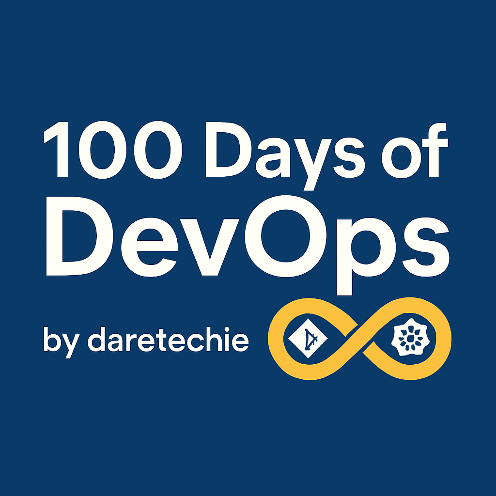

# 🚀 100 Days of DevOps Challenge @ xFusionCorp (KodeKloud)

  

This repository contains my learning journey with xFusionCorp, including both Linux practice tasks and the official **100 Days of DevOps Challenge** from KodeKloud.

##  Quarterly Posts (Dev.to)

- [**Days 1-25: How I Fought Imposter Syndrome and Built Real Momentum**](dev_post.md)
- *More coming soon...*

---

## 🚀 100 Days of DevOps Challenge

This is the official KodeKloud challenge that simulates real-world tasks for **xFusionCorp**'s **Project Nautilus**—a naval-grade application deployed in a 3-tier architecture using LAMP, Nginx, MariaDB, Jenkins, and more.

### Project Nautilus Architecture

- **Data Tier:** MariaDB
- **Application Tier:** LAMP stack
- **Client Tier:** Browser via Nginx load balancer
- **CI/CD:** Jenkins
- **Shared Services:** NAS, SFTP, Backup, Mail
- **Access:** Through Jump Host

---

## 📅 Progress Tracker (Days 1-25)

| Day | Title | Concept | Task | Solution | Notes |
| --- | ----------------------------------------- | ----------------- | ------------------------------------------------------------------- | --------------------------------------------------------------------------------- | --------------------------------------------------------------------- |
| 01 | Create Non-Interactive User | User Management | [Task](day01-create-user-noninteractive/task.md) | [Solution](day01-create-user-noninteractive/create_john.sh) | [Notes](day01-create-user-noninteractive/notes.md) |
| 02 | Create Temporary User w/ Expiry | Account Lifecycle | [Task](day02-create-temp-user-expiry/task.md) | [Solution](day02-create-temp-user-expiry/create_james_temp.sh) | [Notes](day02-create-temp-user-expiry/notes.md) |
| 03 | Disable Root SSH Login | Security | [Task](day03-disable-root-ssh-login/task.md) | [Solution](day03-disable-root-ssh-login/disable-root-ssh.sh) | [Notes](day03-disable-root-ssh-login/notes.md) |
| 04 | Make Script Executable | File Permissions | [Task](day04-make-script-executable/task.md) | [Solution](day04-make-script-executable/make_executable.sh) | [Notes](day04-make-script-executable/notes.md) |
| 05 | Manage SELinux | Security | [Task](day05-install-disable-selinux/task.md) | [Solution](day05-install-disable-selinux/manage_selinux.sh) | [Notes](day05-install-disable-selinux/notes.md) |
| 06 | Setup Cron Job | Automation | [Task](day06-install-cronie-setup-cronjob/task.md) | [Solution](day06-install-cronie-setup-cronjob/setup_cron.sh) | [Notes](day06-install-cronie-setup-cronjob/notes.md) |
| 07 | Passwordless SSH | SSH & Auth | [Task](day07-passwordless-ssh-thor-to-appservers/task.md) | [Solution](day07-passwordless-ssh-thor-to-appservers/setup_passwordless_ssh.sh) | [Notes](day07-passwordless-ssh-thor-to-appservers/notes.md) |
| 08 | Install Ansible 4.7.0 | Automation | [Task](day08-install-ansible-4.7.0/task.md) | [Solution](day08-install-ansible-4.7.0/install_ansible.sh) | [Notes](day08-install-ansible-4.7.0/notes.md) |
| 09 | Fix MariaDB Service | Database Admin | [Task](day09-fix-mariadb-service/task.md) | [Solution](day09-fix-mariadb-service/fix_mariadb.sh) | [Notes](day09-fix-mariadb-service/notes.md) |
| 10 | Website Backup | Automation | [Task](day10-website-backup/task.md) | [Solution](day10-website-backup/news_backup.sh) | [Notes](day10-website-backup/notes.md) |
| 11 | Tomcat Deployment | App Server | [Task](day11-tomcat-deployment/task.md) | [Solution](day11-tomcat-deployment/setup_tomcat.sh) | [Notes](day11-tomcat-deployment/notes.md) |
| 12 | Fix Apache Port | Web Server | [Task](day12-apache-port5003-fix/task.md) | [Solution](day12-apache-port5003-fix/fix_apache.sh) | [Notes](day12-apache-port5003-fix/notes.md) |
| 13 | Secure Apache Port | Security | [Task](day13-secure-apache-port/task.md) | [Solution](day13-secure-apache-port/secure_apache.sh) | [Notes](day13-secure-apache-port/notes.md) |
| 14 | Fix Apache Service | Web Server | [Task](day14-fix-apache-service/task.md) | [Solution](day14-fix-apache-service/fix_apache.sh) | [Notes](day14-fix-apache-service/notes.md) |
| 15 | Nginx SSL Setup | Web Server | [Task](day15-nginx-ssl-setup/task.md) | [Solution](day15-nginx-ssl-setup/setup_nginx_ssl.sh) | [Notes](day15-nginx-ssl-setup/notes.md) |
| 16 | Nginx Load Balancer | Web Server | [Task](day16-nginx-loadbalancer/task.md) | [Solution](day16-nginx-loadbalancer/setup_lbr.sh) | [Notes](day16-nginx-loadbalancer/notes.md) |
| 17 | PostgreSQL Setup | Database Admin | [Task](day17-postgresql-setup/task.md) | [Solution](day17-postgresql-setup/setup_db.sh) | [Notes](day17-postgresql-setup/notes.md) |
| 18 | WordPress Prep | App Server | [Task](day18-wordpress-prep/task.md) | [Solution](day18-wordpress-prep/setup_wordpress_prep.sh) | [Notes](day18-wordpress-prep/notes.md) |
| 19 | Static Sites on Apache | Web Server | [Task](day19-static-sites-apache/task.md) | [Solution](day19-static-sites-apache/setup_static_sites.sh) | [Notes](day19-static-sites-apache/notes.md) |
| 20 | Nginx & PHP-FPM Setup | Web Server | [Task](day20-nginx-phpfpm-setup/task.md) | [Solution](day20-nginx-phpfpm-setup/setup_nginx_phpfpm.sh) | [Notes](day20-nginx-phpfpm-setup/notes.md) |
| 21 | Create Bare Git Repo | Version Control | [Task](day21-create-bare-git-repo/task.md) | [Solution](day21-create-bare-git-repo/setup_git_repo.sh) | [Notes](day21-create-bare-git-repo/notes.md) |
| 22 | Clone Git Repo | Version Control | [Task](day22-clone-git-repo/task.md) | [Solution](day22-clone-git-repo/clone_repo.sh) | [Notes](day22-clone-git-repo/notes.md) |
| 23 | Fork Gitea Repo | Version Control | [Task](day23-gitea-fork-repo/task.md) | [Solution](day23-gitea-fork-repo/fork_repo.sh) | [Notes](day23-gitea-fork-repo/notes.md) |
| 24 | Create Git Branch | Version Control | [Task](day24-create-git-branch/task.md) | [Solution](day24-create-git-branch/create_branch.sh) | [Notes](day24-create-git-branch/notes.md) |
| 25 | Git Branch Merge | Version Control | [Task](day25-git-branch-merge/task.md) | [Solution](day25-git-branch-merge/manage_repo.sh) | [Notes](day25-git-branch-merge/notes.md) |

---

## Reference and Resources

- [KodeKloud 100 Days of DevOps](https://kodekloud.com/100-days-of-devops)
- [xFusionCorp Project Nautilus](https://kodekloudhub.github.io/kodekloud-engineer/docs/projects/nautilus#infrastructure-details)

---

## Join the Challenge

Ready to start your own DevOps journey? 

[**Sign up for KodeKloud Engineer and get started!**](https://engineer.kodekloud.com/signup?referral=64ad8bc7803455eea0a89fde)

---

#devops #100DaysOfDevOps #linux #automation #kodekloud
